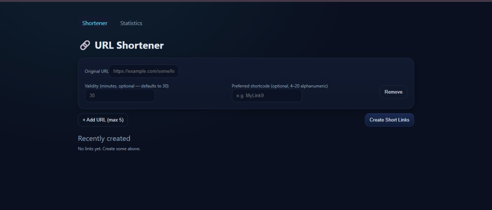
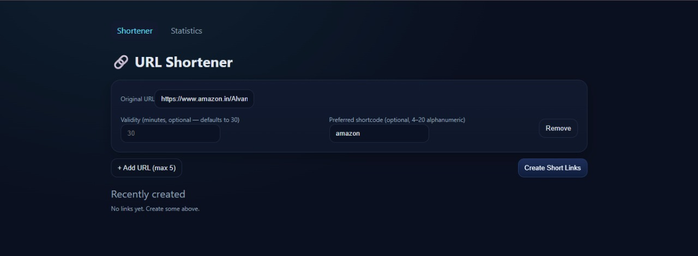
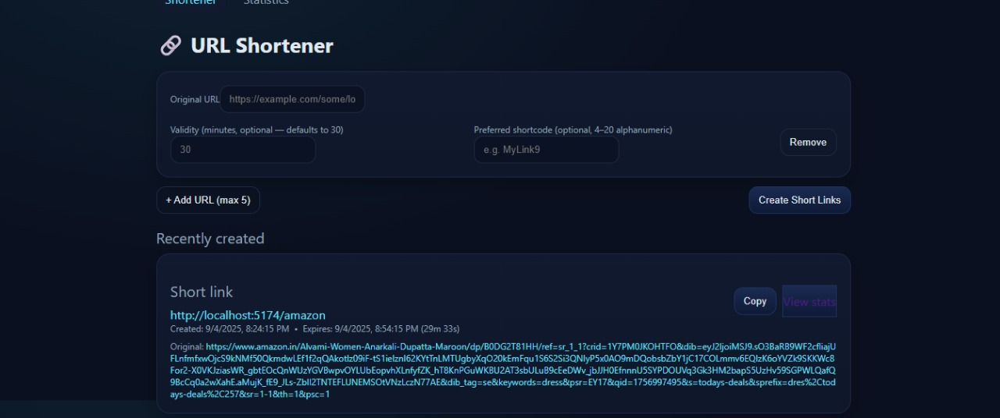

# 🔗 URL Shortener

A simple URL Shortener built with **React + Vite + TypeScript + Redux Toolkit**.  
This app allows you to shorten long URLs, set expiry times, generate custom short codes, view recent links, and check stats.

---

## 🚀 Live Demo
👉 [Live Link Here](https://your-deployed-link.com)  

---

## 📸 Screenshots

### Home / Shortener Page

### Recently Created Links

### Stats Page

*(Place your screenshot images inside a folder named `screenshots/` in your repo root, and update the file names accordingly.)*

---

## ⚡ Features
- Shorten long URLs with unique short codes
- Set custom expiry time for links
- Option to provide a preferred short code
- Copy short links with one click
- Redirect to original URL via short link
- Logs & stats page with history of requests
- LocalStorage persistence (data stays after refresh)

---

## 🛠️ Tech Stack
- [React](https://react.dev/) (Vite + SWC)
- [TypeScript](https://www.typescriptlang.org/)
- [Redux Toolkit](https://redux-toolkit.js.org/)
- [React Router](https://reactrouter.com/)
- [Vite](https://vitejs.dev/)

---

## 📂 Project Structure
url-shortener/
├─ src/
│ ├─ api/
│ ├─ components/
│ ├─ pages/
│ ├─ store/
│ ├─ utils/
│ ├─ App.tsx
│ ├─ main.tsx
│ └─ routes.tsx
├─ public/
├─ index.html
├─ package.json
├─ tsconfig.json
└─ vite.config.ts

🤝 Contributing

Contributions are welcome!
Feel free to fork this repo and create a PR with improvements.
